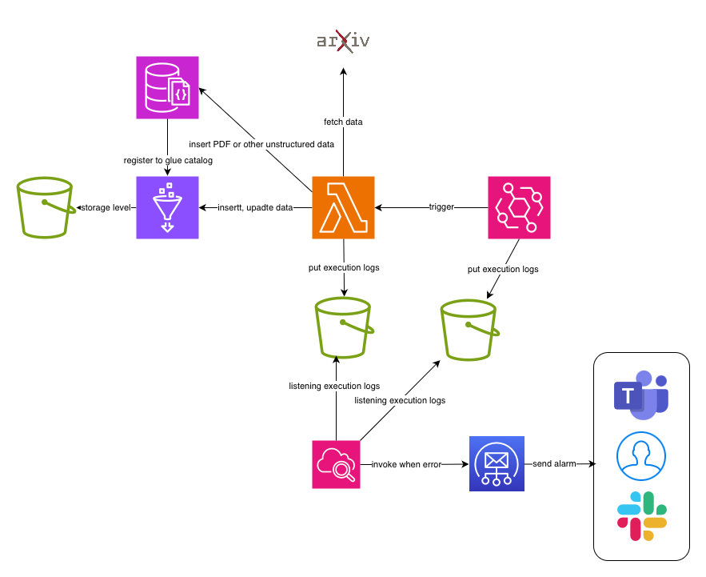

# Thesis Crawler System (arXiv 資料擷取管線)

此專案使用 AWS CDK (TypeScript) 建置一個自動化的 arXiv 論文資料擷取與資料清洗。
架構圖如下：

流程重點如下：
- 以 EventBridge Rule 每日排程觸發爬蟲。
- AWS Lambda 執行爬取與資料處理邏輯。
- 結構化資料輸出到指定 S3 bucket（作為資料湖）。
- 非結構化或文件型資料存入 Amazon DocumentDB（MongoDB 相容）。
- 產生的 metadata 註冊至 AWS Glue Catalog（供後續查詢 / ETL 使用）。
- Lambda 與 EventBridge 的執行紀錄（logs）會匯出到指定位置（CloudWatch Logs，並可外送到 S3）。
- 透過 CloudWatch MetricFilter + Alarm 監控異常；Alarm 透過 SNS 並由 SES（驗證的 email）通知使用者。

部署方法
1. 安裝相依套件
   - aws cli
   - cdk
   - node
2. 設定 aws cli，請參閱[官方文件](https://docs.aws.amazon.com/zh_tw/cli/v1/userguide/cli-chap-configure.html)
3. 測試 aws cli 運作
   - aws sts get-caller-identity
   - 若設定正確則可以取得當前 token 的 UserId, Account, Arn 資訊
4. 檢視資源異動
   - cdk diff
5. 部署資源
   - 一次性部署全部資源：cdk deploy --all
   - 部署部分資源：cdk deploy ${stack_name}
   - 可使用 AWS_PROFILE 指定帳號：cdk deploy --all --profile ${your_profile}
